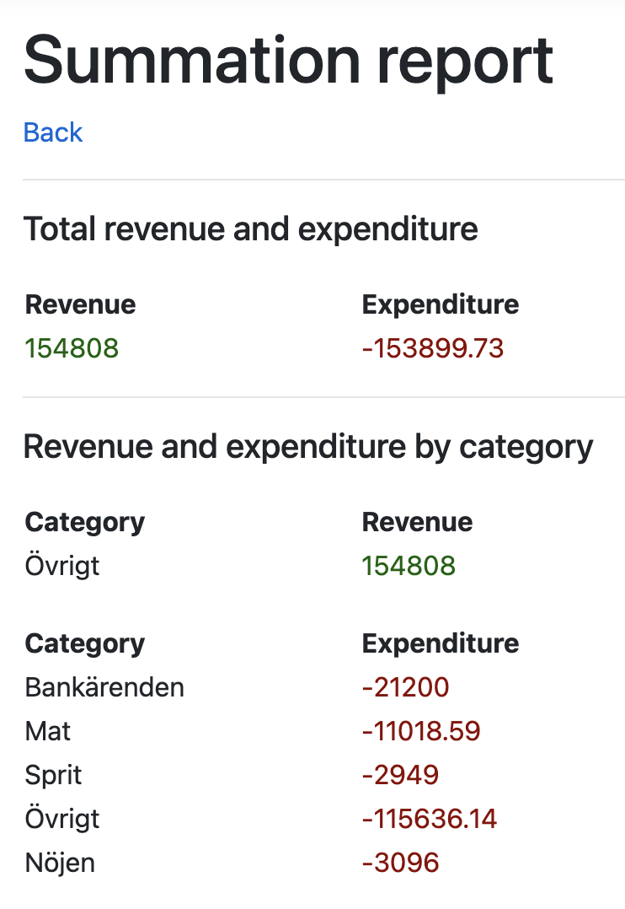

# BankTransactionMVC
An ASP.NET Core MVC application for a university project that enables categorization of dummy transaction data.

#### The application
This is an application that manages bank transactions and enables features such as categorization and summation of these transactions. It is developed using ASP.NET Core and covers UI, backend processing as well as database communication.

#### Features
**Reload transactions** - If there is any transaction data in the database, this is what will be displayed to the user. The **reload transactions** feature will clear the database of any transactions and fetch updated transaction data from the external API and write it to the database, thus allowing the user to update in case of any new transactions. Fetching data from the API will not overwrite any user-defined categorization.

**Manage categories** - This allows the user to add their own transaction categories.

**Manage categorization** - This allows users to define categorization rules where a transaction's reference text can be mapped to a certain category. For instance, the user can define a rule so that all transactions labelled *Withdrawal* will be categorized as a *bank errand*.

**Summation report** - This will calculate the total expenditures as well as revenue for all transactions currently in the database. It will also display the expenditure and revenue for each category. In addition, it will build an XML file containing all the summation data and download it.

It is also possible to assign categories directly to specific transactions. If a category is assigned this way, it will *always* supersede any categorization rules by reference value (defined using the **Manage categorization** feature).

#### Screenshots

